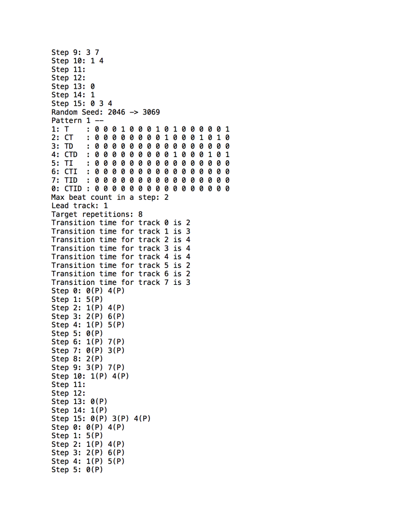
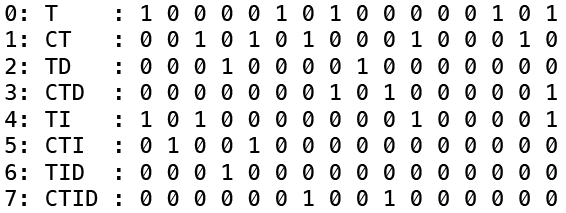

  # Ensayo de Horizontalidad

## INTRODUCCIÓN

HORIZON-T corresponde a un algoritmo creador de ritmos de percusión, creado para la obra <a href="http://cargocollective.com/mserranoa/Ensayo-de-horizontalidad" target="_blank"><i>Ensayo de horizontalidad</i></a>, pero con la posibilidad de ser implementado como un generador de secuencias, aplicables a la percusión o a las melodías.

Está pensado desde los clásicos secuenciadores del siglo XX, y reutilizados por los softwares digitales (Ableton Live, FL Studio, etc.), donde a través de una interfaz de luces y un contador, se escriben los puntos donde se disparan los sonidos en la línea de tiempo.

 La construcción de este algoritmo está basada en criterios del contrapunto, de las fugas de Bach y de los desfases propuestos en las obras de Steve Reich.

Cada línea vertical representa un paso, y cada horizontal representa una pista. Un contador revisa cada paso de izquierda a derecha, y gatilla el sonido correspondiente a su pista cuando encuentra un 1, así, en la imagen anterior, en el primer paso activa las pistas 0 y 4, en el siguiente la 5, en la siguiente 1 y 4, y así sucesivamente...

## FUNCIONAMIENTO

0) Primero el algoritmo debe definir variables que afectarán a la construcción de los patrones y su variación, las cuales son las siguientes:

- Número de pistas.
- Número de pasos.
- Velocidad en BPM: Máximos, mínimos, y rango de variación posible entre un ritmo y el siguiente.
- Polifonía máxima: Número máximo de sonidos que pueden generarse en un mismo paso.
- Número de repeticiones de cada patrón.
- Tiempo de transición entre un patrón y el siguiente: zona intermedia entre los patrones, con el fin de evitar cambios bruscos.

1) El código genera un máximo de pasos disponibles para completar, y un número de pistas. Para estos ejemplos trabajaremos con 8 pasos y 8 pistas.

        Así lucen 8 pasos vacíos en una pista. El contador recorre cada paso de izquierda a derecha, y no dispara nunca un sonido, al no encontrarse con ningún 1.

<code>0 0 0 0 0 0 0 0</code>

2) Posteriormente, se elige un margen de una cantidad mínima y máxima de valores a rellenar, donde en este caso el mínimo posible sería 0, y el máximo 8.

        Asumamos que el código elige rellenar 3 de estos pasos, seleccionándolos de forma aleatoria

<code>T :    1 0 0 1 0 0 1 0</code>

    Esta pista se llamará Tema (T), y es la que define el ritmo principal.

3) Luego se generará el Contra-Tema (CT), el cuál responde al tema principal. Este solo puede rellenar en los espacios donde el T no escribió antes:

<code>T    :    1 0 0 1 0 0 1 0  
  CT:  0 1 1 0 0 0 0 1</code>

    Sin embargo, el algoritmo es capaz de omitir (o no) algunos de estos pasos, para evitar que estas respuestas sean monótonas. Si decidimos que se pueda omitir <i>hasta</i> 2 pasos, esta vez decidiremos omitir un paso de la pista CT

<code>T    :    1 0 0 1 0 0 1 0</code>  
<code>CT:  0 0 1 0 0 0 0 1</code>

4) La siguiente pista corresponde al Tema-Desfasado, el cuál, a partir del T, lo moverá hacia la derecha una cantidad n de pasos. Esta vez la trasladaremos dos casillas. Si se supera el margen de la derecha, se traslada a la izquierda.

<code>T    :    1 0 0 1 0 0 1 0</code>  
<code>CT:  0 0 1 0 0 0 0 1</code>  
<code>TD:    1 0 1 0 0 1 0 0</code>

    Este TD también puede ser afectado por omisiones. Omitiremos un paso.

<code>T    :    1 0 0 1 0 0 1 0</code>  
<code>CT:  0 0 1 0 0 0 0 1</code>  
<code>TD:    0 0 1 0 0 1 0 0</code>

5) Finalmente, realizaremos un Tema-Invertido, el cual corresponde a un reflejo del T. El primer paso pasa a ser el último, el segundo al penúltimo, etc.

<code>T    :    1 0 0 1 0 0 1 0</code>  
<code>CT:  0 0 1 0 0 0 0 1</code>  
<code>TD:    0 0 1 0 0 1 0 0</code>  
<code>TI:    0 1 0 0 1 0 0 1</code>

    Nuevamente podemos decidir omitir en estas nueva pista, así que lo haremos con 2 pasos.

<code>T    :    1 0 0 1 0 0 1 0</code>  
<code>CT:  0 0 1 0 0 0 0 1</code>  
<code>TD:    0 0 1 0 0 1 0 0</code>  
<code>TI:    0 0 0 0 1 0 0 0</code>

    Así, ya tenemos un patrón musical coherente para 4 sonidos. Pueden imaginar que se pueden volver a complejizar las generaciones para los nuevos sonidos, creando desfases del CT (un CTD), inversiones del TD (un TDI), e incluso un Contra-Tema-Desfasado-Invertido (CTDI). 

 ## ENCADENAR PATRONES

    Al encadenar patrones, el algoritmo es capaz de generar una transición, donde se reproducen sonidos correspondientes al patrón anterior, antes de reproducir del patrón siguiente. Esta transición es la que construye los momentos de tensión, previos al relajo que significa cuando se establece cada patrón. Pensemos el patrón anterior, e insertémosle de forma contigua uno nuevo, el cual fue pensado para un tema de 4 sonidos, con sus nuevas omisiones, y con una polifonía máxima de 2. Asumiremos también que cada patrón se repite  solo una vez

<code>T    :    1 0 0 1 0 0 1 0 | 0 1 0 0 1 0 1 1 |</code>  
<code>CT:  0 0 1 0 0 0 0 1 | 1 0 0 1 0 1 0 0 | </code>  
<code>TD:    0 0 1 0 0 1 0 0 | 1 0 0 1 0 0 1 0 | </code>  
<code>TI:    0 0 0 0 1 0 0 0 | 0 1 0 1 0 0 0 0 |</code>  
<code>     Patrón 1___________ | Patrón 2_______ |</code>

    Corregiremos la polifonía del segundo patrón, eliminando cualquiera de sus 1s en el cuarto paso.

<code>T    :    1 0 0 1 0 0 1 0 | 0 1 0 0 1 0 1 1 |</code>  
<code>CT:  0 0 1 0 0 0 0 1 | 1 0 0 1 0 1 0 0 | </code>  
<code>TD:    0 0 1 0 0 1 0 0 | 1 0 0 0 0 0 1 0 | </code>  
<code>TI:    0 0 0 0 1 0 0 0 | 0 1 0 1 0 0 0 0 |</code>  
<code>     Patrón 1___________ | Patrón 2_______ |</code>

    Ahora insertaremos una vuelta de transición, donde solo se eliminarán algunos pasos del patrón anterior.

<code>T    :    1 0 0 1 0 0 1 0 | 0 0 0 1 0 0 1 0 | 0 1 0 0 1 0 1 1 |</code>  
<code>CT:  0 0 1 0 0 0 0 1 | 0 0 1 0 0 0 0 0 | 1 0 0 1 0 1 0 0 | </code>  
<code>TD:    0 0 1 0 0 1 0 0 | 0 0 0 0 0 1 0 0 | 1 0 0 0 0 0 1 0 | </code>  
<code>TI:    0 0 0 0 1 0 0 0 | 0 0 0 0 0 0 0 0 | 0 1 0 1 0 0 0 0 |</code>  
<code>     Patrón 1___________ | Transición_____ |Patrón 2________ |</code>

    Estas transiciones pueden contener no solo omisiones del patrón anterior, sino valores del patrón siguiente. Insertaremos algunos.

<code>T    :    1 0 0 1 0 0 1 0 | 0 0 0 1 0 0 1 1 | 0 1 0 0 1 0 1 1 |</code>  
<code>CT:  0 0 1 0 0 0 0 1 | 0 0 1 0 0 1 0 0 | 1 0 0 1 0 1 0 0 | </code>  
<code>TD:    0 0 1 0 0 1 0 0 | 1 0 0 0 0 1 0 0 | 1 0 0 0 0 0 1 0 | </code>  
<code>TI:    0 0 0 0 1 0 0 0 | 0 1 0 1 0 0 0 0 | 0 1 0 1 0 0 0 0 |</code>  
<code>     Patrón 1___________ | Transición_____ |Patrón 2________ |</code>

        Para musicalizar esto, podemos imaginar que el primer patrón se repite 4 veces, luego genera la transición solo con omisiones del primero por 2 repeticiones, luego completa esta transición con pasos del futuro patrón por otras 2 repeticiones, y finalmente se resuelve en el nuevo patrón. Esto entabla a la primera vuelta un tema, luego la tensiona por 4 compases y cambia a la siguiente, donde se puede repetir este procedimiento para el futuro.

## CONCLUSIÓN

Este algoritmo, o método compositivo, es escalable según la cantidad de pasos posibles, de la polifonía del número de transiciones entre patrones, de variaciones del tema, del número de omisiones, etc., lo cuál puede representar un método de aproximación a la composición rítmica, o secuencial, si lo asignamos a notas. O tal vez un método para construir progresiones de acordes que incluya - o no - intercambios modales.

Si bien esto fue implementado en <i>Ensayo de horizontalidad</i> con servomotores que golpeaban objetos físicos, donde el algoritmo estaba contenido dentro de un Arduino y este no analizaba la "musicalidad" de los patrones ni de las transiciones, al usar este procedimiento desde una escucha de los sonidos, puede ayudar a potenciar las posibilidades creativas, donde estas reglas pueden ser respetadas - o no -, según el compositor y lo que le dicte su paladar acústico. Se entiende a HORIZON-T como una herramienta más en la generación de diversidad y llevar más allá las ideas musicales.

## AGRADECIMIENTOS

A Sean Moscoso, por la voluntad de colaborar en la construcción y pensamiento de este algoritmo, y a Elías Zacarías, por su implementación del algoritmo en lenguaje de Arduino.

## LINKS

Implementación en Arduino para 8 Servomotores: <a href="https://github.com/22bits/HRZN-T" target="_blank">https://github.com/22bits/HRZN-T</a>  
Clapping Music, de Steve Reich: <a href="https://www.youtube.com/watch?v=lzkOFJMI5i8" target="_blank">https://www.youtube.com/watch?v=lzkOFJMI5i8</a>  
Web de Sean Moscoso: <a href="https://seanmoscoso.blogspot.com" target="_blank">https://seanmoscoso.blogspot.com</a>  
Web de Elías Zacarías: <a href="http://blog.damnsoft.org" target="_blank">http://blog.damnsoft.org</a>

## DISCLAIMER

<i>Este código Fue pensado e ideado por el Colectivo 22bits (Bárbara Molina y Matías Serrano) junto a Sean Moscoso, y programado en Arduino por Elías Zacarías para la obra "Ensayo de horizontalidad", montada en el MAC de Quinta Normal entre junio y agosto de 2017. Se agradece y se fomenta cualquier clase de difusión y modificación, ya sea total o parcial, y se agradece compartir los resultados con los creadores.
</i>

